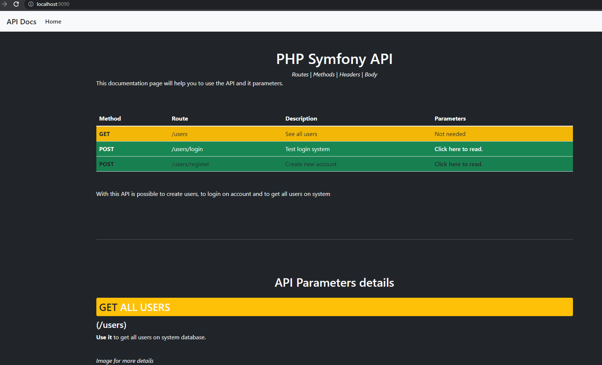
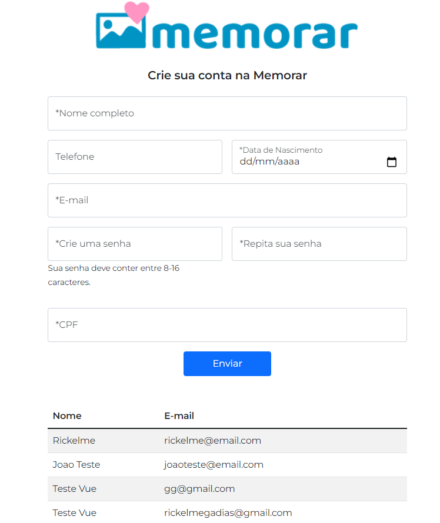
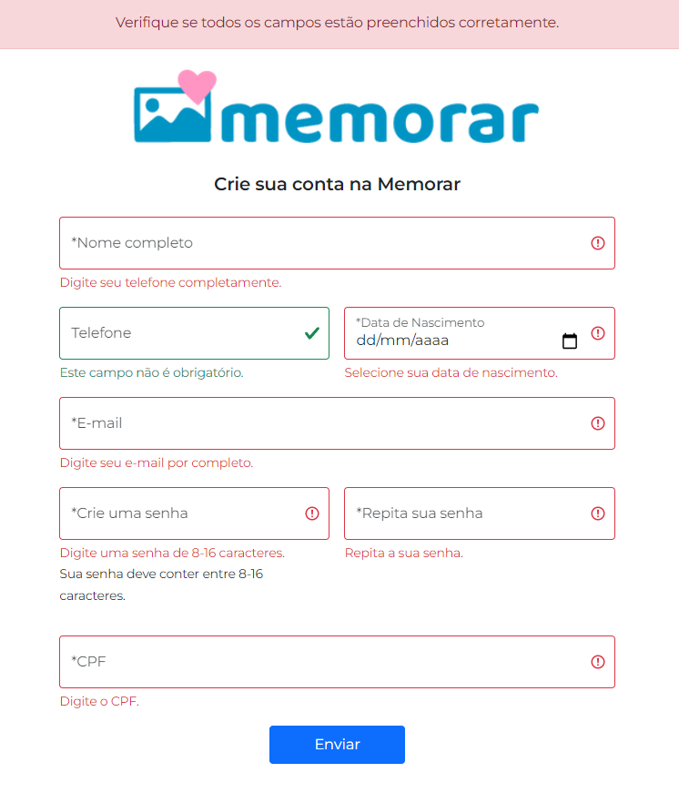

# Web Developer Forms Challenge (Symfony + Vue)
Helped and assisted by [Vanessa Trentin from Auryn](https://github.com/vanessatrentin) and [Paulo Trentin from Auryn](https://github.com/paulopmt1).

## About Challenge

This challenge was developed based on some requirements:
- Develop Full-Stack of a form to register an account using the technologies below:
  - Back-End: Symfony (Php);
  - Front-End: Vue.js (Javascript);
  - PostgreSQL;
  - Docker (The configured docker was delivered by Paulo to do the technical challenge).

The project also have validation in the forms and a documentation written by me.

## Getting Started

When running the back-end (Symfony) you can access the documentation on `http://localhost:9090/`

You should see this docs:

After run the back-end you can run the front-end and create accounts, **is important you create the database using the back-end readme informations.**

All working well, you can access the frontend.

When running the front-end (Vue) you can access the website on `http://localhost:8080/`:

You should see this screen:

Want to see the validations? Open details below:

## Acknowledgment

Thanks  and <a href="https://github.com/paulopmt1">Paulo Trentin</a> for the knwoledge learned in the challenge!

